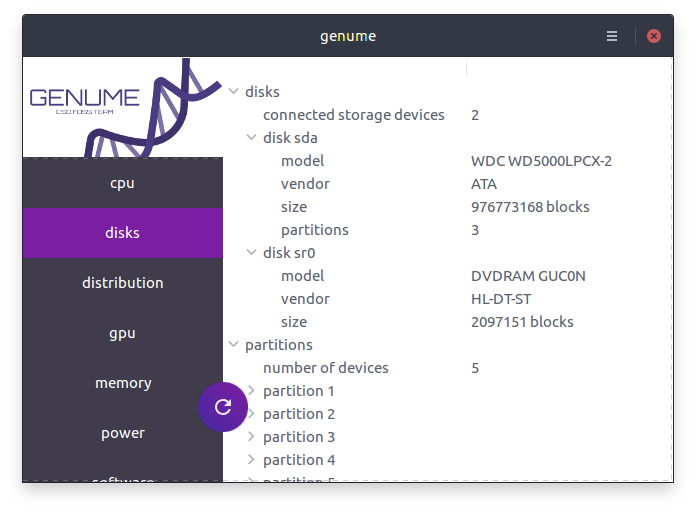

# genume - *graphical enumeration*

**genume** is a graphical user interface for a collection of enumeration scripts.

Build with **Python 3** and **Gtk+3**.

First `git clone https://github.com/CSD-FOSS-Team/genume.git`

Start **genume** by running `make` or `python3 -m genume`.

## Features

By default genume displays the collected information in a gui. But it can also export the enumeration in file format. Please run `python3 -m genume --help` to see the list of supported exporters.

## Install

TODO: #22

## Support for raspberry

[tested in raspberry pi3 with raspbian]

$sudo apt-get install python3-gi
 run 
$make

## Contribute

We accept Pull requests!

Pull requests that are not ready to be merged should have a title starting with `[WIP]`.

Not necessary but suggested to pass your code from the pycodestyle check by running `make lint`

## License

All files in this repository are Copyright (c) 2018 **genume author list**.

Code in this repository is licensed under [GNU General Public License v2.0](https://www.gnu.org/licenses/old-licenses/gpl-2.0.en.html).

Data in this repository is licensed under the
[Creative Commons Attribution-ShareAlike 4.0 International License](http://creativecommons.org/licenses/by-sa/4.0/).

**genume author list** can be determined via `git shortlog -sne`.
